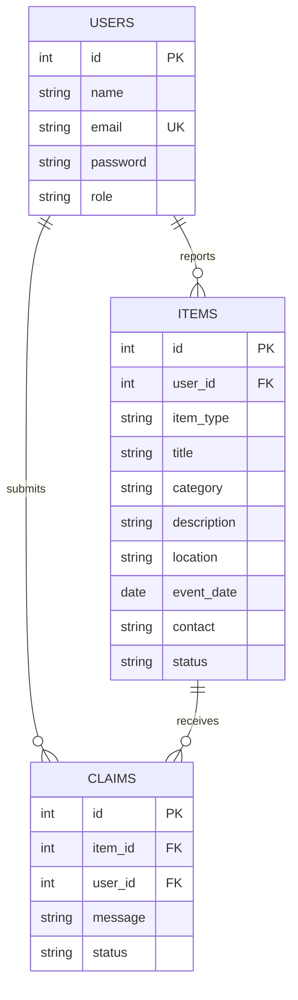

# ER Diagram — FindIt Lost & Found System

```mermaid
erDiagram
    USERS ||--o{ ITEMS : reports
    USERS ||--o{ CLAIMS : submits
    ITEMS ||--o{ CLAIMS : receives

    USERS {
        int id PK
        string name
        string email UK
        string password
        string role
    }
    ITEMS {
        int id PK
        int user_id FK
        string item_type
        string title
        string category
        string description
        string location
        date event_date
        string contact
        string status
    }
    CLAIMS {
        int id PK
        int item_id FK
        int user_id FK
        string message
        string status
    }
```

## Relationships
1. One user can report many items.
2. One user can submit many claims.
3. One item can receive many claims.
